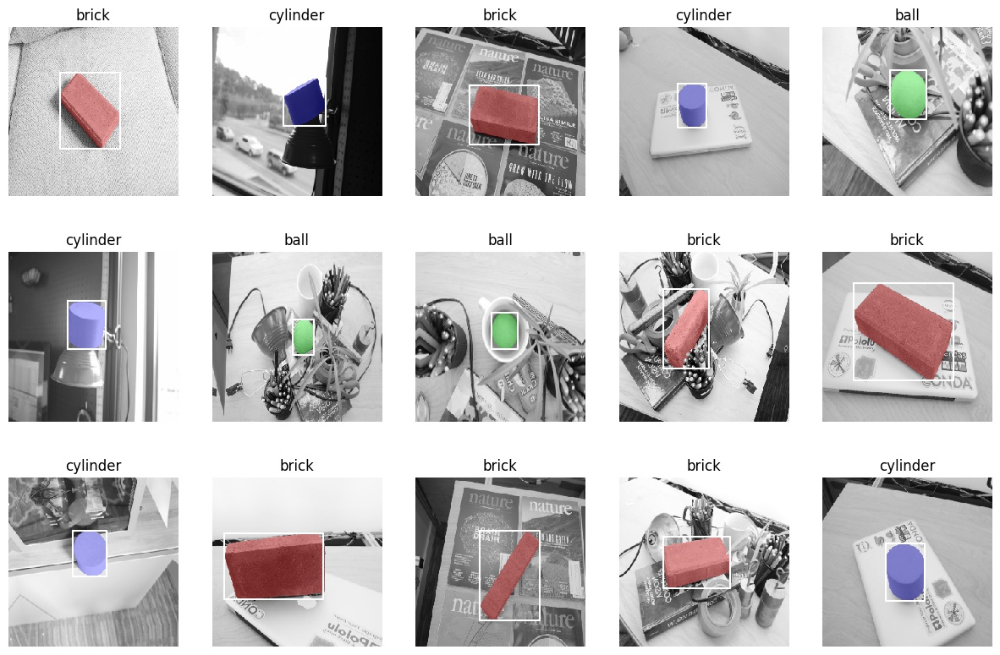

# Deep Learning Workshop


## Agenda
|   | Session | Approximate Start Time (PST) | Resources | 
| - | --------| ---------------------- | --------- |
| 1 | Welcome!| 1:00 | | 
| 2 | Setting up your computing environment | 1:05 | | 
| 3 | Storytime - the summer project that took 50 years | 1:15 | | 
| 4 | Getting image classification results fast with [fastai](https://docs.fast.ai/) | 1:25 | [](https://colab.research.google.com/github/stephencwelch/dsgo-dl-workshop-summer-2020/blob/master/01-image-classification-with-fastai.ipynb) |
| 5 | Bounding box detection | 1:50 |[](https://colab.research.google.com/github/stephencwelch/dsgo-dl-workshop-summer-2020/blob/master/02-bounding-box-detection.ipynb)| 
| 5 | Break | 2:10 | | 
| 6 | Semantic segmentation | 2:20 | [](https://colab.research.google.com/github/stephencwelch/dsgo-dl-workshop-summer-2020/blob/master/03-semantic-segmentation.ipynb)|
| 7 | Deploying models with [docker](https://github.com/moby/moby) and [render](http://render.com) | 2:40 | | 
| 8 | Q&A | 3:10 | |
| 9 | (Optional, if time) Deep dive into alexnext, GANs | | | 
| 10 | (Optional, if time) Reflection on studying and working in AI in 2020 | | |

## 1. Welcome!

### 1.1 Goal for Our Time Together
Train and deploy deep learning computer vision models, and have some fun along the way :)

## 2. Setting up your computing environment
Installing the software you need to train deep learning models can be difficult. For the purposes of this workshop, we're offering 3 recommended methods of setting up your computing environment. Your level of experience and access to machines, should help you determine which appraoch is right for you. 

| | Option | Pros | Cons | Cost | Instructions | 
| - | ------ | ---- | ---- | ---- | ------------ | 
| 1 | Google Colab | Virtually no setup required, start coding right away! | GPUs not always available, limited session times, limited RAM | Free! There's also a paid tier at [$10/month](https://colab.research.google.com/signup) | [Colab Setup](https://github.com/stephencwelch/dsgo-dl-workshop-summer-2020#1-setup-google-colab) |
| 2 | Your Own Linux GPU Machine | No recurring cost, complete control over hardware. | High up-front cost, takes time to configure. | $1000+ fixed up front cost | [Linux Setup](https://github.com/stephencwelch/dsgo-dl-workshop-summer-2020#2-setup-on-your-own-gpu-machine-running-linux) |
| 3 | Virtual Machine | Highly configurable & flexible, pay for the performance level you need | Can be difficult to configure, only terminal-based interface | Starts ~$1/hour | [Azure VM Setup](https://github.com/stephencwelch/dsgo-dl-workshop-summer-2020#3-setup-a-virtual-machine) |

### 2.1 Setup Google Colab
Google colab is delightfully easy to setup. All you really need to is a google account. Clicking one of the "Open in Colab" links above should take you directly to that notebook in google colab, ready to run. The only configuration change you'll be required to make is **changing your runtime type**. Simply click the runtime menu dropdown at the top of your notebook, select "change runtime type", and select "GPU" as your hardware accelerator. 

### 2.2 Setup on Your Own GPU Machine Running Linux
After doing this for a while, my preferred configuration is training models on my own Linux GPU machine. This can require some up front investment, but if you're going to be training a lot of models, having your own machine really makes your life easier. 

2.2.1 Install [Anaconda Python](https://www.anaconda.com/products/individual)

2.2.2 Clone this repository
```
git clone https://github.com/stephencwelch/dsgo-dl-workshop-summer-2020

```

2.2.3 (Optional) Create conda environment
```
conda create -n dsgo-cv python=3.7
conda activate dsgo-cv
```

2.2.4 Install packages
```
cd dsgo-dl-workshop-summer-2020
pip install -r requirements.txt
```

2.2.5 Launch Jupyter
```
jupyter notebook
```


### 2.2 Setup a Virtual Machine


## 3. Storytime - the summer project that took 50 years

### 3.1 The Original Problem 


**Computer Vision** has a very interesting history. It's roots really go all the way back to the beginning of computing and **Artifical Intelligence.** In these early days, it was unknown just how easy or difficult it would be to recreate the function of the human visual system. A great example of this is the 1966 MIT Summer Vision Project. Marvin Minsky and Seymour Papert, co-directors of the MIT AI Labratory, begun the summer with some ambitious goals:


Minsky and Papert assigned Gerald Sussman, an MIT undergraduate studunt as project lead, and setup specific goals for the group around recognizing specific objects in images, and seperating these objects from their backgrounds. 


Just how hard is it to acheive the goals Minsky and Papert laid out? How has the field of computer vision advance since that summer? Are these tasks trivial now, 50+ years later? Do we understand how the human visual system works? Just how hard *is* computer vision and how far have we come?

### 3.2 Computer Vision is Hard

Interestingly, comptuer vision  turns out to be significantly harder than people first expected. Part of the challenge here is that vision, like other processes that involve the brain, can be a bit hard to pin down. 

What exactly does it mean to see? To have vision?

You’re probably using your own vision system right now to read these words, but if I asked you to break down piece by piece how exactly your brain is processing the light that hits your retina into meaningful information, you would have a really tough time. 

The vision researchers Peter Hart and Richard Duda had a really nice way of putting this when they wrote one of the first [computer vision books](https://www.amazon.com/Pattern-Classification-Scene-Analysis-Richard/dp/0471223611): 

> "Paradoxically, we are all expert at perception, but none of us knows much about it."

Now, as you may know, it’s taken longer than we thought, but we have made some good progress in computer vision. Today, the computer vision systems we’ve built are even better than humans at certain tasks. 

### 3.3 Everything Popular is Wrong

In fact, in today's workshop, **we'll achieve exactly what Minsky and Papert set out to do.** And what I think makes this *really* interesting, is that just 10 years ago, this really would not have been possible. You see, it really took around 50 years to achieve the goals of the MIT summer project. 

Now, just becuase it took 50 years to acheive these goals, this does not mean that we should only pay attention to recent breakthroughs. Computer vision has a rich and detailed history that deeply informs that work we see today. One aspect that we would be remiss if we didn't breifly discuss is the tradeoff between **analytical and empirical techniques**.

### Part of an analytical pipeline for recognizing a brick


Throughout the history of computer vision (and computation and philosophy), we've seen a natural oscillation and competition between techniques that are grounded in reason (analytical), and techniques that are grounding in observation or data. Today we live in a time that is very much dominated by empricism. Decisions must be data driven. In machine learning and computer vision, we see huge breakthroughs from emprical techniques that learn from data, such as deep learning. 

So as we dive into building and training our own deep learning models, just remember that this is only one approach. We've seen huge performance increases from empirical approaches recently, and that's what we'll be spending our time on here. 

### 3.4 Our dataset for the day
To solve the original computer vision problem using an emprical appraoch, we're going to need some data. We'll be using a fun little dataset called bbc1k. This dataset was collected in the spirit of the original MIT summer project, and contains 1000 images of bricks, balls, and cylinders against cluttered backgrounds. 


You can download the dataset [here](http://www.welchlabs.io/unccv/deep_learning/bbc_train.zip), or with the download script in the util directory of this repo:

```
python util/get_and_unpack.py -url http://www.welchlabs.io/unccv/deep_learning/bbc_train.zip
```



 BBC-1k dataset includes ~1000 images including classification, bounding box, and segmentation labels. Importantly, each image only contains one brick, ball or cylinder.

### 3.5 Further Reading & Viewing
- [Computer Vision Course at UNCC](https://github.com/unccv/uncc_course_overview)
- [Learning to See](https://www.youtube.com/watch?v=i8D90DkCLhI)
- [Great Book on the History of AI](https://www.amazon.com/Ai-Tumultuous-History-Artificial-Intelligence/dp/0465029973)

## 4-6 Model Training
Instructions for sections 4-6 are contained inside of the image classification, bounding box detection, and semantic segmentation notebooks. You ran quickly run these notebooks in google colab using the links above, or you can run the notebooks on your own machine by launching your own notebook server:

```
cd dsgo-dl-workshop-summer-2020
jupyter notebook
```

## 7. Deploying models with docker and render
Alright, enough training, let's get something into production!

If you haven't yet cloned this respoistory, please


```
python app/server.py serve
```

```
docker build -t bbc-classifier .
```

```
docker run --rm -it -p 5000:5000 bbc-classifier
```

## 7. Reflection on studying and working in AI in 2020
