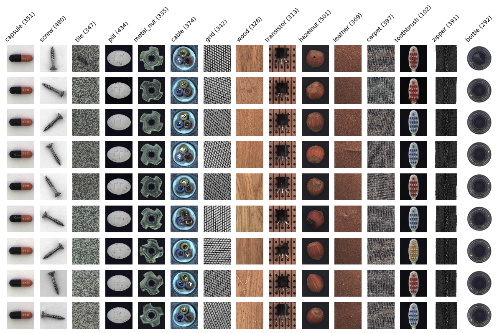
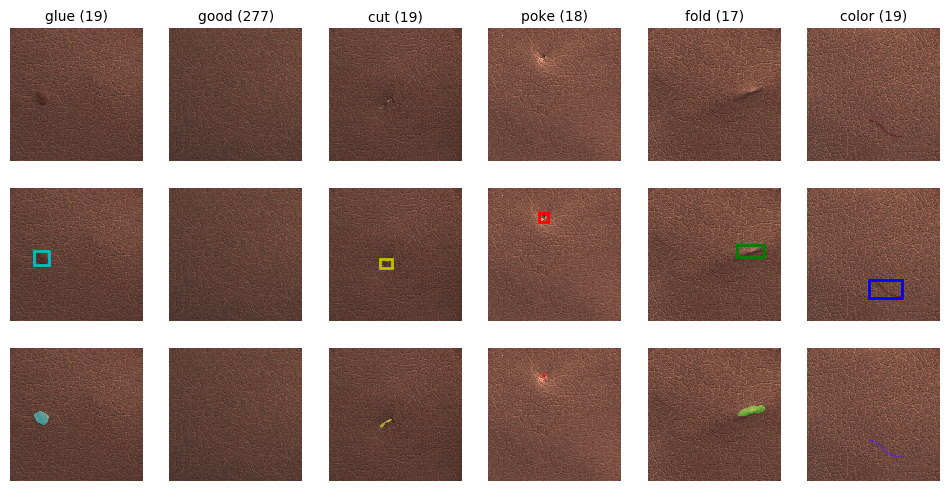

# Deep Learning Workshop

## Agenda
1. Welcome!
2. Setting up your computing environment
3. Introduction to our dataset for the day - [MVTech AD](https://www.mvtec.com/company/research/datasets/mvtec-ad/) 
4. Getting image classification results fast with [fastai](https://docs.fast.ai/). 
5. Detection, segmentation, and unsupervised learning. 
6. Deploying models with [docker](https://github.com/moby/moby) and [flask](https://github.com/pallets/flask). 
7. Reflection on studying and working in AI in 2020

## 1. Welcome!

### 1.1 Goal for Our Time Together
**Train and deploy  deep learning computer vision models, and have some fun along the way :)**

## 2. Setting up your computing environment
Installing the software you need to train deep learning models can be difficult. For the purposes of this workshop, we're offering 3 recommended methods of setting up your computing environment. Your level of experience and access to machines, should help you determine which appraoch is right for you. 

| | Option | Pros | Cons | Cost | Instructions | 
| - | ------ | ---- | ---- | ---- | ------------ | 
| 1 | Google Colab | Virtually no setup required, start coding right away! | GPUs not always available, limited session times, limited RAM | Free! There's also a paid tier at [$10/month](https://colab.research.google.com/signup) | [Colab Setup](https://github.com/stephencwelch/dsgo-dl-workshop-summer-2020#1-setup-google-colab) |
| 2 | Virtual Machine | Highly configurable & flexible, pay for the performance level you need | Can be difficult to configure, only terminal-based interface | Starts ~$1/hour | [Azure VM Setup](https://github.com/stephencwelch/dsgo-dl-workshop-summer-2020#2-setup-an-azure-virtual-machine) |
| 3 | Your Own Linux GPU Machine | No recurring cost, complete control over hardware. | High up-front cost, takes time to configure. | $1000+ fixed up front cost | [Linux Setup](https://github.com/stephencwelch/dsgo-dl-workshop-summer-2020#3-setup-on-your-own-gpu-machine-running-linux) |

### 2.1 Setup Google Colab

### 2.2 Setup an Azure Virtual Machine

### 2.3 Setup on Your Own GPU Machine Running Linux

## 3. The Data
In this workshop, we'll be working with the [MVTech AD](https://www.mvtec.com/company/research/datasets/mvtec-ad/) dataset. This is a terrific computer vision dataset, focused on anomaly detection in manfuacturing. The dataset is primarily intended for unsupervised anomaly detection, but can be used in supervised deep learning appraoches as well. 

The mvtech data is highly representative of the types of real deep-learning problems we see in the wild, and includes high quality ground-truth pixel-level annotations. 

## 4. Getting image classification results fast with fastai

## 6. Deploying models with docker and flask

## 7. Reflection on studying and working in AI in 2020
